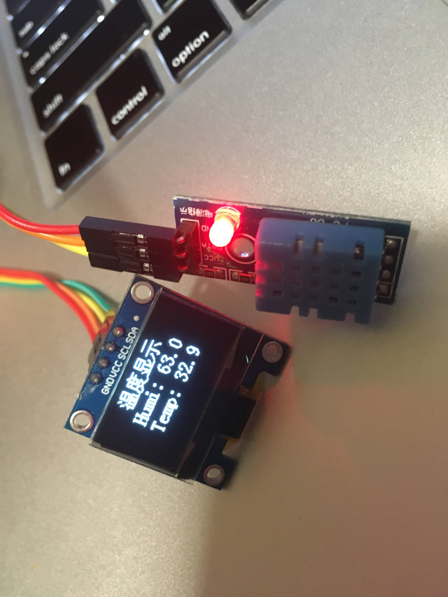

# 使用 DHT11 获取温湿度信息并且显示在OLED上

### STM32工程项目

├─Doc 
├─Libraries 
│  ├─CMSIS 
│  │  └─startup 
│  ├─FWlib 
│  │  ├─inc 
│  │  └─src 
│  └─STM32F10x_StdPeriph_Driver 
│      ├─inc 
│      └─src 
├─OUTPUT 
├─Project 
│  ├─Listings 
│  └─Objects 
└─User 
    ├─bsp_dht11 
    ├─bsp_i2c 
    ├─bsp_oled 
    ├─bsp_systick 
    ├─bsp_time 
    └─bsp_usart 

### C# 串口上位机 SerialCom

└─SerialCom 
    ├─bin 
    │  └─Debug 
    ├─obj 
    │  └─Debug 
    │      └─TempPE 
    └─Properties 

### 运行效果

