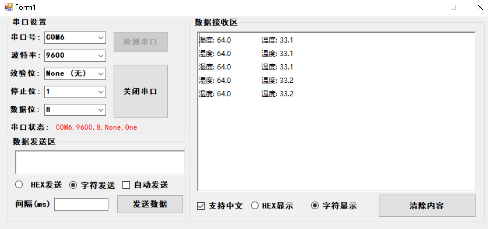

# 使用 DHT11 获取温湿度信息并且显示在OLED上

### STM32工程项目

├─Doc
├─Libraries
│  ├─CMSIS
│  │  └─startup
│  ├─FWlib
│  │  ├─inc
│  │  └─src
│  └─STM32F10x_StdPeriph_Driver
│      ├─inc
│      └─src
├─OUTPUT
├─Project
│  ├─Listings
│  └─Objects
└─User
    ├─bsp_dht11
    ├─bsp_i2c
    ├─bsp_oled
    ├─bsp_systick
    ├─bsp_time
    └─bsp_usart

### C# 串口上位机 SerialCom

└─SerialCom
    ├─bin
    │  └─Debug
    ├─obj
    │  └─Debug
    │      └─TempPE
    └─Properties

### 运行效果

